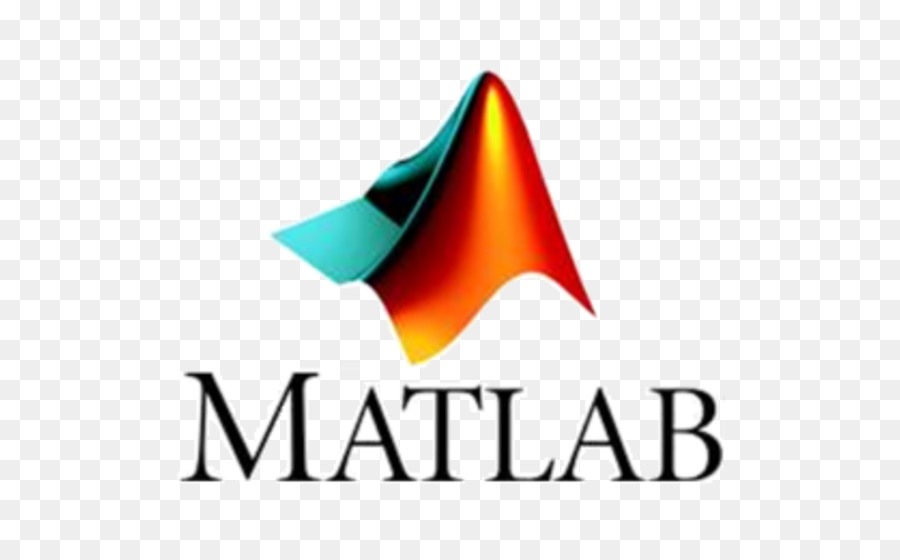

### Hi there 👋 I'm Eldhose Poulose 🧔🏻

[ LinkedIn](https://www.linkedin.com/in/pouloseeldhose/)

I am an expert in solving real world problems with AI and ML. I hold a Bachelor's in Electronics and Communication Engineering from India, Master's in Computational Life Sciences from Switzerland. I pursued an MSc in Artificial Intelligence and Data Science in Germany and Czech Republic at THD, Deggendorf and University of South Bohemia, Ceske Budejovice, where I completed all required courseworks. I chose to transition into a full-time data scientist role before completing the thesis component, in order to seize a timely opportunity that aligned strongly with my career goals and practical interests in applied machine learning and analytics. My ultimate goal is to work as an AI Engineer. I like automating things, building pipelines, exploring scalability problems and improving efficiency and performance.

- 🔭 Currently working as Data Scientist (since 15.05.2023)
- 🇩🇪🇨🇿 Msc in AI and Data Science (started on 15.03.2021)
- 👨🏽‍💻 Finished Internship as Data Scientist (01.10.2021 - 30.09.2022)
- 🌱 Nurturing skills in Data Science/Machine Learning
- 💡 I'm interested in discussing topics from Machine Learning, Data Science, Big Data, Cloud and AI
- 👯 I’m looking to collaborate on Data Science/Machine Learning Course creations.
- 💬 Talk to me about: Travelling, Technology, Innovative ideas to solve your problems.
- 📚 Book that I am currently reading "The Singularity Is Near: When Humans Transcend Biology" Written by Ray Kurzweil
- 🛸 Lived/Visited in: 🇨🇭Switzerland 🇩🇪 Germany 🇦🇹 Austria 🇫🇷 France 🇮🇳 India 🇨🇿 Czech 
- 🚀 Places to Visit: 🇮🇪 Ireland 🇸🇪 Sweden 🇳🇴 Norway 🇫🇮 Finland 🇩🇰 Denmark 🇸🇰Slovakia

**My Skills include**

       

**Certifictions**

 - IBM Data Science Professional Certification (Achieved on 14.06.2021)
 - https://coursera.org/share/e86a4ae2586f45c781c1c5f72477da68
 

TBD

<!--
**EldhosePoulose/eldhosepoulose** is a ✨ _special_ ✨ repository because its `README.md` (this file) appears on your GitHub profile.

<!-- 

 

 
-->

<!-- Light Mode -->

 

<!-- Dark Mode -->

 

      
